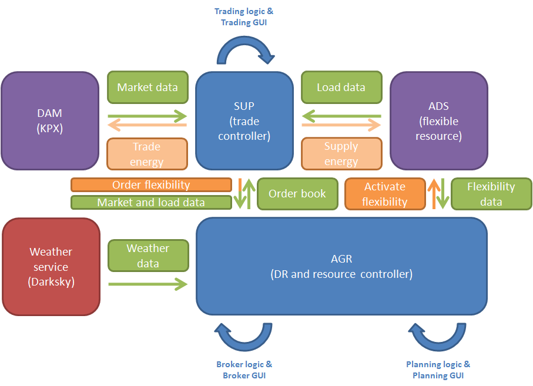
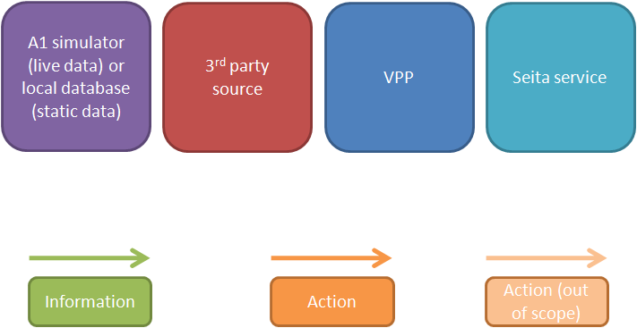

.. _components:

*********************************************
What components does FlexMeasures consist of?
*********************************************

..    :scale: 40%

Legend

..    :scale: 10% 

Platform components
===================

Trade controller
----------------

Trading logic and trading UI for Supplier.

DR controller
-------------

Broker logic and broker UI for Aggregator.

Resource controller
-------------------

Planning logic and planning UI for Prosumer.

External components
===================

Power systems simulator
-----------------------

The platform can be coupled to a power systems simulator.
This simulator needs to provide price data and consumption/production data from assets.

.. _weather:

Weather service
---------------

The platform is coupled to the Darksky weather service.

Note: Apple Inc. has bought Darksky and will discontinue this service during 2021.
      We are scouting which alternative to switch to.